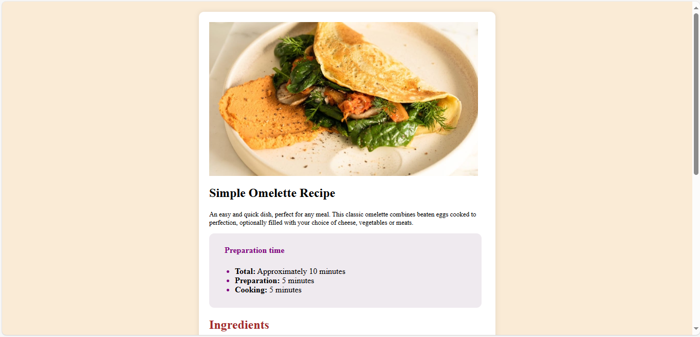
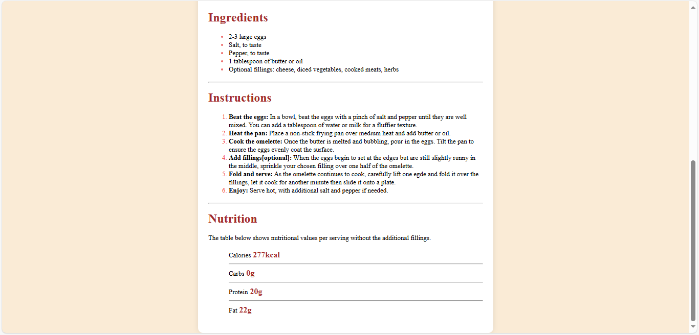

# Simple Omelette Recipe

A clean and responsive recipe webpage built using HTML and CSS.  
This project displays a basic omelette recipe with preparation time, ingredients, instructions, and nutritional facts.

## Features
- Clean UI with responsive layout
- Clear recipe structure with sections
- Styled with vanilla CSS

## Live Demo
https://echo-script0.github.io/Recipe-page/

## Screenshot
 

## Technologies
- HTML 5
- CSS (Flexbox)

## Author
- Aisha Adeyemo ✨
- Frontend Mentor - (https://www.frontendmentor.io/profile/echo-script0)
